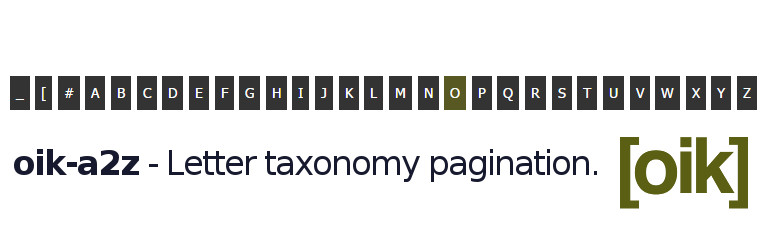

# oik-a2z 

* Contributors: bobbingwide
* Donate link: https://www.oik-plugins.com/oik/oik-donate/
* Tags: shortcodes, smart, lazy
* Requires at least: 4.9.8
* Tested up to: 6.7.1
* Stable tag: 0.2.0
* License: GPLv2 or later
* License URI: http://www.gnu.org/licenses/gpl-2.0.html

## Description 

Letter taxonomy pagination.

This is what this plugin is supposed to do.
See https://github.com/bobbingwide/oik-a2z/issues/1

- Automatically sets the value for the identified first letter taxonomies using extendable rules.
- Provides a taxonomy page with selectable letters.
- Taxonomy can be associated to any post type.
- Supports batch setting by post type and letter taxonomy.

## Installation 
1. Upload the contents of the oik-a2z plugin to the `/wp-content/plugins/oik-a2z' directory
1. Activate the oik-a2z plugin through the 'Plugins' menu in WordPress
1. Define additional post type to pagination taxonomy relationships

## Screenshots 
1. Displaying the Letter taxonomy for 'l'

## Upgrade Notice 
# 0.2.0 
Update for support for PHP 8.4

# 0.1.0 
Upgrade for peaceful co-existance with WordPress 5.0 and Gutenberg

# 0.0.5 
Default taxonomy name is letters, plural.

# 0.0.4 
Now provides the [bw_terms] shortcode.

# 0.0.3 
Now automatically sets the letter taxonomy term when a post is saved.

# 0.0.2 
Now highlights the currently active taxonomy term.

# 0.0.1 
Now provides 'oik_a2z_display' action for use in themes.

# 0.0.0 
New plugin, available from oik-plugins and GitHub

## Changelog 
# 0.2.0 
* Changed: Only register [bw_terms] shortcode if bw_add_shortcodes() is actually available #10
* Changed: Don't run oik-a2z-run anymore #4
* Fixed: Avoid Warnings when the taxonomy is invalid #9
* Tested: With WordPress 6.7.1
* Tested: With PHP 8.3 & PHP 8.4

# 0.1.0 
* Changed: Enable automatic letter taxonomy creation using the Block editor https://github.com/bobbingwide/oik-a2z/issues/8
* Changed: Support setting letter terms in oik-batch https://github.com/bobbingwide/oik-a2z/issues/7
* Fixed: Avoid message for using deprecated bw_posts.inc - now bw_posts.php
* Tested: With WordPress 5.0.3
* Tested: With PHP 7.2

# 0.0.5
* Changed: Default taxonomy name is "Letters"
* Added: Support display of a particular post_type.
* Added: Support oikwp oik-a2z.php post_type=post_type
* Added: Add admin interface to set letter terms and box to display defined letter taxonomies https://github.com/bobbingwide/oik-a2z/issues/4
* Fixed: Notice: Undefined letter that I knew existed but wasn't seeing

# 0.0.4 
* Added: [bw_terms] shortcode https://github.com/bobbingwide/oik-a2z/issues/3
* Fixed: Cater for special characters like '&' https://github.com/bobbingwide/oik-a2z/issues/2

# 0.0.3 
* Changed: Automatically set the 'letter' taxonomy term when a post is saved.

# 0.0.2 
* Changed: Highlights the currently active term.

# 0.0.1 
* Changed: Implement 'oik_a2z_display' https://github.com/bobbingwide/oik-a2z/issues/1
* Changed: Improve improve batch facility to set letter terms https://github.com/bobbingwide/oik-a2z/issues/2
* Tested: With WordPress 4.7.2 and WordPress Multisite

# 0.0.0 
* Added: New plugin https://github.com/bobbingwide/oik-a2z/issues/1
* Added: use oikwp oik-a2z.php to populate the "Letter" taxonomy for posts
